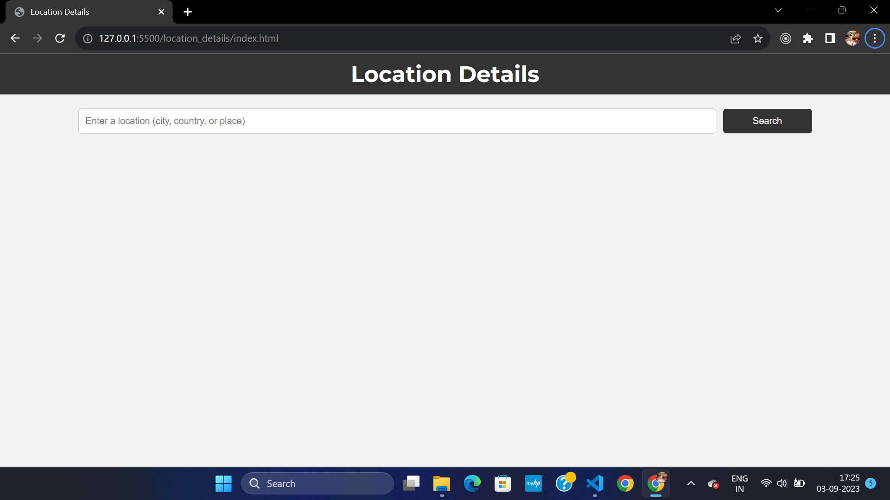
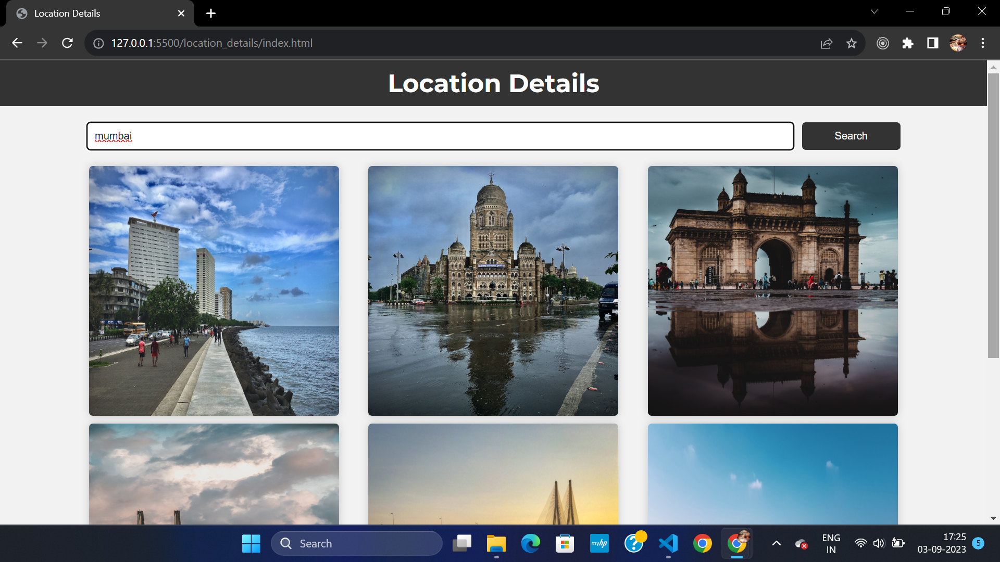
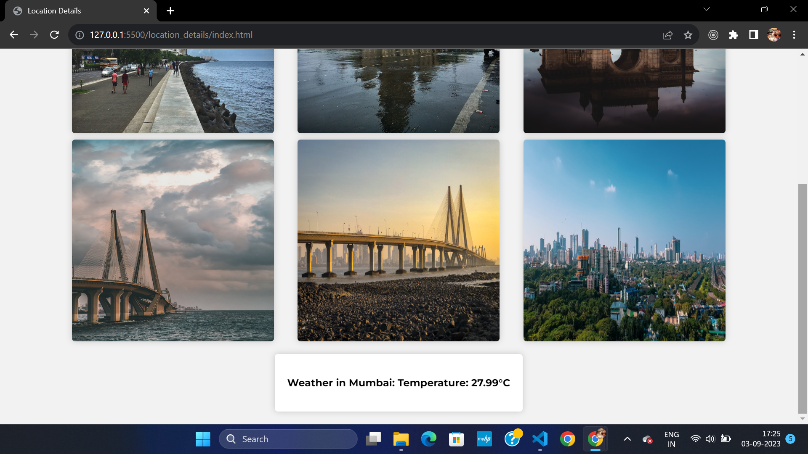

# LOCATION DETAILS

The Location Details web application allows users to retrieve information about a specific location, including six images and weather details. Here's how to set up and use the application:

## Table of Contents

- [Installation](#installation)
- [Usage](#usage)
- [Screenshots](#screenshots)
- [Tech Stack](#tech-stack)

---

## Installation

To run this project locally, follow these steps:

1. **Clone the Repository**

   ```shell
   git clone https://github.com/Priyajha017/location_details.git
   ```

2. **Navigate to the Project Directory**

   ```shell
   cd location_details
   ```

3. **Set Environment Variables**

   - Create a `.env` file in the project's root directory.
   - Add your API keys to the `.env` file:
     - `WEATHER_API_KEY=your_openweathermap_api_key`
     - `UNSPLASH_API_KEY=your_unsplash_api_key`

4. **Start a Local Server**

   Use a local server of your choice to serve the project files. For example, you can use Python's built-in HTTP server:

   ```shell
   python -m http.server
   ```

5. **Access the Application**

   Open your web browser and go to http://localhost:8000 (or the URL provided by your local server) to access the running application.

---

## Usage

1. **Enter a Location**

   - On the web page, enter the name of a location (city, country, or place) into the input field.

2. **View Location Details**

   - After entering a location and waiting briefly, the application will display six images of the location and weather details.

3. **Weather Details**

   - The weather details include the location's name and temperature in Celsius.

4. **Enjoy Exploring**

   - Explore different locations by entering their names and discovering their images and weather conditions.

---

## Screenshots





---

## Tech Stack

- HTML5
- CSS3
- JavaScript
- [OpenWeatherMap API](https://openweathermap.org/)
- [Unsplash API](https://unsplash.com/developers)

---

**Note:** Make sure to replace `weatherApiKey` and `unsplashApiKey` in the `.env` file with your actual API keys obtained from the respective services.

Happy location exploration! 🌍📷☀️